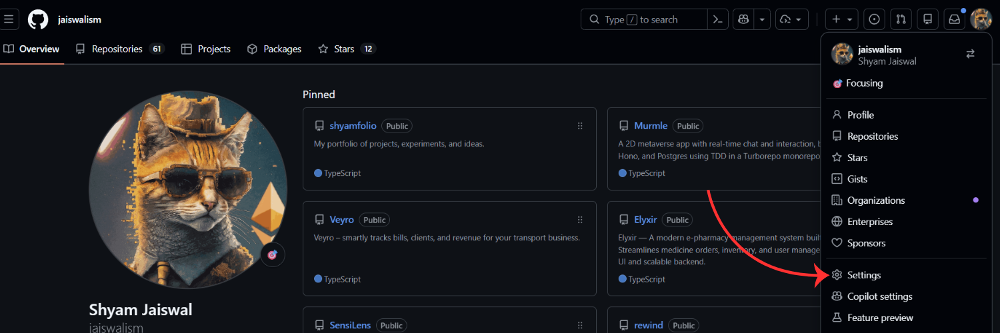
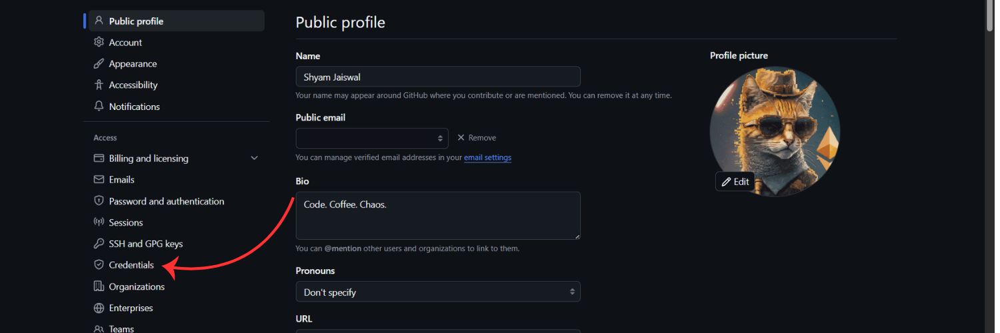
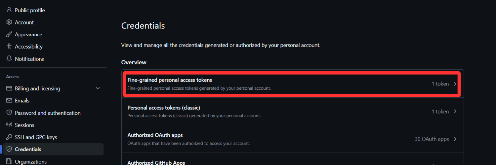

# CommitCode

<p align="center">
  <em>A privacy-focused Chrome Extension that automatically syncs your LeetCode submissions directly to your own GitHub repository.</em>
</p>

## ✨ Features

- **Zero Third-Party Servers**: CommitCode connects directly to GitHub via their official REST API. There are no intermediate servers, no databases, and absolutely no data harvesting.
- **Fine-Grained Access Control**: Uses modern GitHub fine-grained Personal Access Tokens. You grant access strictly to a single repository of your choosing—not your entire GitHub account.
- **Flexible Folder Structures**: Organize your solutions exactly how you want them:
  - By Difficulty (`Easy/1-two-sum.js`)
  - By Topic (if available)
  - By Language (`javascript/1-two-sum.js`)
  - Flat structure
- **Duplicate Detection**: Intelligently hashes your code to prevent spamming your repo with identical submissions if you click "Submit" multiple times.
- **Offline Retry Queue**: If your internet drops or GitHub's API rate limits you, your submissions are safely stored in a local queue and automatically retried later.
- **Popup Dashboard**: Click the extension icon to view your sync status, see detailed logs, and manage any pending commits directly from the queue.
- **Smart Versioning**: Optionally keep a history of your attempts (e.g., `_v1`, `_v2`) or choose to overwrite them in place.
- **Auto-generated README**: Automatically maintains a markdown table and difficulty stats right in your repository.
- **File Headers**: Automatically prepends metadata (Title, Difficulty, Runtime, Memory, LeetCode URL) to every uploaded file.

---

## 🚀 Installation

### Option 1: Easy Installation (Recommended)
You do not need to build the extension yourself. You can download the latest pre-built version directly from our releases!

1. Go to the [Releases](https://github.com/jaiswalism/commitcode/releases) page of this repository.
2. Download the `commitcode-extension.zip` file from the latest release.
3. Extract the `.zip` file on your computer.
4. Open Google Chrome and navigate to `chrome://extensions/`.
5. Enable **Developer mode** (toggle switch in the top right corner).
6. Click **Load unpacked** in the top left corner.
7. Select the extracted folder!

### Option 2: Build from Source (Developer Mode)

Since CommitCode is currently in active development, you can also build it directly from source.

1. **Clone or Download this repository** to your local machine:
   ```bash
   git clone https://github.com/jaiswalism/commitcode.git
   ```
2. **Install dependencies and build** the project:
   ```bash
   cd commitcode
   npm install
   npm run build
   ```
3. Open Google Chrome and navigate to `chrome://extensions/`.
4. Enable **Developer mode** (toggle switch in the top right corner).
5. Click **Load unpacked** in the top left corner.
6. Select the `dist/` folder generated in step 2.

---

## ⚙️ Setup Guide

To get CommitCode working, you need to create a dedicated GitHub repository and provide the extension with a Fine-Grained Personal Access Token (PAT).

### Step 1: Create a Repository
Create a NEW, empty repository on GitHub (e.g., `leetcode-solutions`).

### Step 2: Generate a Token
1. Click on your GitHub profile picture and go to **Settings**.
<br>


2. Under "Access" on the left sidebar, click **Credentials**.
<br>


3. Click on **Personal access tokens** -> **Fine-grained tokens**.
<br>


4. Click **Generate new token**.
<br>


### Step 3: Configure Token Permissions
1. Give your token a name, like `CommitCode Sync`.
2. Set an **Expiration date** (you can set it to No Expiration if you don't want to recreate it later).
3. Under **Repository access**, select **Only select repositories** and choose the new repository you created in Step 1.
<br>


4. Under **Permissions** -> **Repository permissions**, find **Contents** and change the access to **Read and write**.
<br>


### Step 4: Add to Extension
1. Click **Generate token** at the bottom of the page and copy the token (it will only be shown once!).
2. Open the CommitCode Options page.
3. Paste the token into the **Personal Access Token** field.
4. Enter your repository name in the format `username/repo-name` (e.g., `jaiswalism/leetcode-solutions`).
5. Select your preferred sync preferences (folder structure, versioning mode).

You are ready! Just solve a problem on LeetCode and CommitCode will handle the rest!

---

## 🔒 Privacy Guarantee

Your code, token, and stats stay strictly between your browser and GitHub. We don't track you, we don't store your data, and we don't use external servers. 

## 📜 License and Attribution

This project is open-source under the **MIT License**. 

You are free to use, copy, modify, and distribute this software, **provided that you give explicit credit to the original author (Shyam Jaiswal)**. The original copyright notice and permission notice must be included in all copies or substantial portions of the software.
